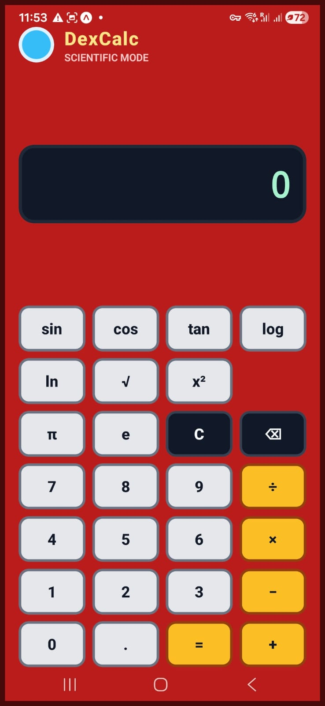

# sci-calc-app

A retro handheld-inspired scientific calculator built with React Native, Expo, and TypeScript.

The app includes a custom calculator interface, scientific functions, calculation history, input validation, reusable UI components, and a tested calculator engine separated from the interface.

## Screenshot



## Features

* Basic arithmetic: addition, subtraction, multiplication, and division
* Scientific functions:

  * Square root
  * Square
  * Sine, cosine, and tangent
  * Base-10 logarithm
  * Natural logarithm
* Constants:

  * π
  * e
* Degree-based trigonometric calculations
* Input validation for repeated operators and decimals
* Error handling for invalid calculations such as division by zero and invalid logarithms
* Formatted decimal results
* Calculation history
* Component-based React Native UI
* Unit-tested calculator logic with Jest
* Android APK build configured with EAS Build

## Tech Stack

* React Native
* Expo
* TypeScript
* Jest
* EAS Build
* Git/GitHub

## Project Structure

```text
app/
  index.tsx
  _layout.tsx

assets/
  screenshots/
    DexCalc_Main_Screen.jpeg

src/
  components/
    calculator/
      CalculatorButton.tsx
      CalculatorDisplay.tsx
      CalculatorHistory.tsx
      CalculatorKeypad.tsx

  features/
    calculator/
      calculatorEngine.ts
      calculatorEngine.test.ts
      calculatorTypes.ts
```

## Getting Started

Install dependencies:

```bash
npm install
```

Start the Expo development server:

```bash
npx expo start
```

Run the test suite:

```bash
npm test
```

Build an Android APK:

```bash
npm run build:android:apk
```

## Testing

The calculator engine is separated from the UI and tested independently. The Jest test suite covers:

* Initial calculator state
* Number input
* Clearing and backspace behavior
* Arithmetic operations
* Scientific functions
* Constants
* Decimal formatting
* Invalid input handling
* Calculation history

## Android APK Build

This project has been built as an installable Android APK using EAS Build and tested on a physical Android device.

Build details:

* Platform: Android
* Build profile: preview
* SDK version: 54.0.0
* App version: 1.0.0
* Build type: APK

## Current Status

This project is a functional MVP scientific calculator. The main calculator logic, UI, reusable components, history feature, tests, and Android APK build are complete.

## Future Improvements

* Add DEG/RAD mode toggle
* Add exponent operations such as xʸ
* Add eˣ and 10ˣ functions
* Add nth-root support
* Add fraction mode
* Add UI animations
* Publish APK through a GitHub Release
